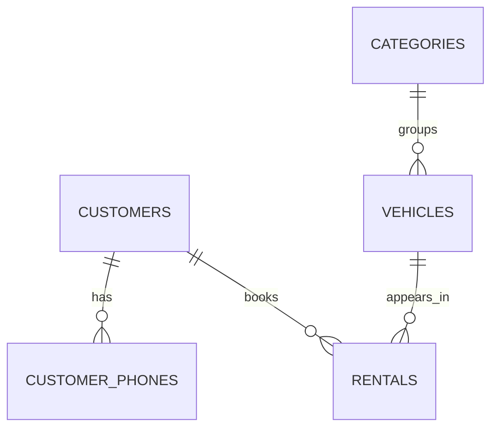

# SQL Rental System

An educational vehicle-rental database with customers, multiple phone numbers per customer, vehicle categories, vehicles, and bookings. Includes sample records and useful queries.

**Database dialect: SQLite, not MySQL.** Use the included Python runner; the scripts are not intended to be pasted directly into XAMPP/phpMyAdmin.

## Quick demo

Requires Python 3.10+ with SQLite 3.38 or newer:

```bash
python main.py demo
```

This creates a temporary in-memory database and prints four reports. No persistent file is created.

Key results:

```text
Rental 1: Andi, Toyota Agya, 2 days, total 500000
Rental 2: Citra, Daihatsu Terios, 2 days, total 950000
Rental 3: Budi, Toyota Agya, cancelled
Available vehicle for Sep 20-22: DEMO-02, Toyota Avanza
Non-cancelled booking value: 1450000
```

The actual report uses pipe-separated columns. Booking value is not proof that payment was received.

To keep a database:

```bash
python main.py init
python main.py report
```

`init` creates `rental.db` and refuses to overwrite any existing file. To create a different database, use `python main.py init --database another.db`.

## Relationships



## Business rules

- Each rental covers one vehicle and one customer.
- Dates use half-open intervals: `[start_date, end_date)`; a return and new pickup can share a date.
- Minimum duration is one day. Impossible dates and non-positive rates are rejected.
- Non-cancelled bookings cannot overlap for the same vehicle. Triggers check inserts and updates, including cancellation reversal.
- Rental rates are copied into each booking so later price changes do not alter existing booking totals.
- Phone numbers are child records because a customer may have several numbers.
- Rates and totals are integer rupiah, without taxes or late fees.
- Any connection that writes to SQLite must enable `PRAGMA foreign_keys=ON`; the runner does this.

## Files

- `schema.sql`: tables, constraints, indexes, overlap triggers.
- `seed.sql`: fictional demonstration records; run once on a fresh schema.
- `queries.sql`: joins, LEFT JOIN counts, availability, booking totals.
- `main.py`: demo, initialization, reports.
- `test_database.py`: integrity and overlap checks.

## Test

```bash
python -m unittest -v
```

This is a database exercise, not a production rental service. It does not include login, payment records, multi-vehicle contracts, or a web interface.

## Development

This is a small learning project generated with AI assistance. Run it, read the code, and adapt it before presenting it as part of your portfolio. Sample names and records are fictional. See `ROADMAP.md` for specific next improvements.
